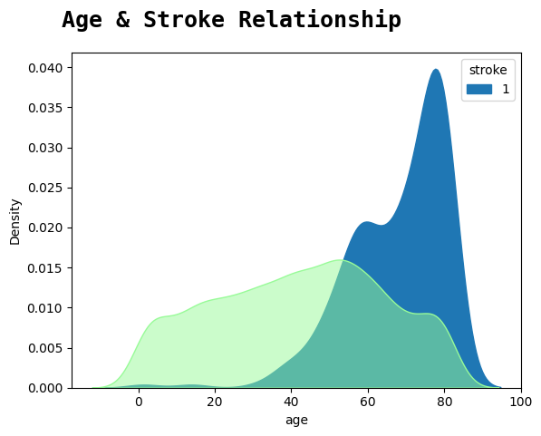
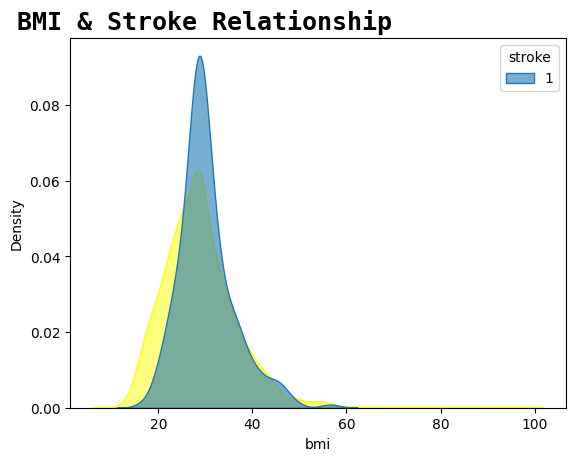
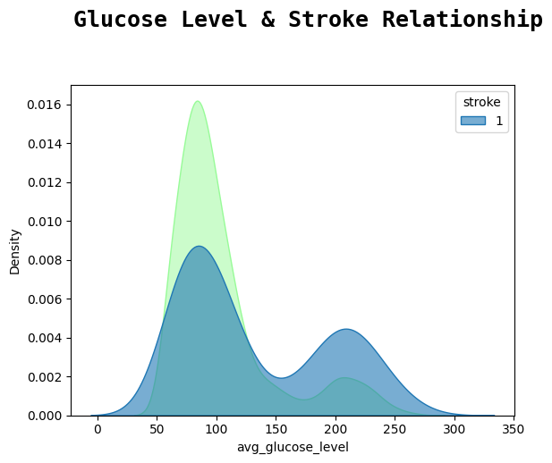
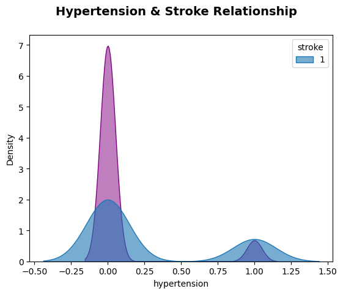

# Stroke Prediction using Machine Learning 

## Overview
This project aims to predict the likelihood of a stroke using various machine learning algorithms. By analyzing medical and demographic data, we can identify key factors that contribute to stroke risk and build a predictive model to aid in early diagnosis and prevention.

## Table of Contents
- [Introduction](#introduction)
- [Problem Statement](#problem-statement)
- [Methodology](#methodology)
  - [Data Collection](#data-collection)
  - [Data Preprocessing](#data-preprocessing)
  - [Model Development](#model-development)
- [Results](#results)
- [Visualizations](#visualizations)
- [Deployment](#deployment)
- [How to Contribute](#how-to-contribute)
- [References](#references)

## Introduction
Brain stroke, also known as a cerebrovascular accident (CVA), is a medical emergency characterized by the sudden interruption of blood flow to the brain, leading to a range of neurological impairments. Early detection and prompt intervention are crucial in preventing the devastating consequences of strokes and improving patient outcomes. This project utilizes machine learning techniques to predict stroke risk based on various health and demographic factors.

## Problem Statement
Stroke is a leading cause of death and disability worldwide. The high mortality and long-term care requirements impose a significant burden on healthcare systems and families. By developing a predictive model, we aim to:
1. Reduce the incidence of stroke through early intervention.
2. Alleviate healthcare costs associated with long-term stroke care.
3. Improve the quality of life for individuals at risk.

## Methodology
### Data Collection
We acquired datasets from Kaggle, encompassing demographic, clinical, and lifestyle factors. The data includes variables such as age, BMI, blood glucose levels, hypertension status, and more.

### Data Preprocessing
Data preprocessing involves handling missing values, encoding categorical variables, and scaling numerical features. Exploratory Data Analysis (EDA) helps in understanding the data distribution and identifying key features.

### Model Development
We employed several machine learning algorithms to develop the predictive model, including Logistic Regression, K-Nearest Neighbors (KNN), Support Vector Machine (SVM), Random Forest, and others. The data was split into training and testing sets to evaluate the model's performance.

## Results
The performance of various models was evaluated based on accuracy, precision, recall, and F1 score. The Random Forest and Gradient Boosting Machines (GBM) showed the best performance with the highest accuracy rates.

## Visualizations
Below are some visualizations illustrating the correlation between different factors and stroke risk:

<div style="display: flex; flex-wrap: wrap; justify-content: center;">
    
    
    
    
</div>

## Deployment
The model has been deployed as a web application using Streamlit, making it accessible for real-time stroke risk assessment. You can access the application at [Stroke Prediction App](https://stroke-prediction-garvitjoshi01.streamlit.app/).

## How to Contribute
We welcome contributions from the community. Here are some ways you can contribute:
1. **Data Improvement**: Provide more comprehensive datasets to enhance the model.
2. **Model Enhancement**: Experiment with different algorithms and improve the accuracy of predictions.
3. **Documentation**: Help improve the documentation and add more examples.

### Steps to Contribute
1. Fork the repository.
2. Clone the forked repository.
   ```bash
   git clone https://github.com/your-username/stroke-prediction.git
3. Make your changes and commit them.
   ```bash
   git add .
   git commit -m "Description of your changes"
4. Push to the branch.
   ```bash
   git push origin feature-branch
5. Create a pull request describing your changes.
